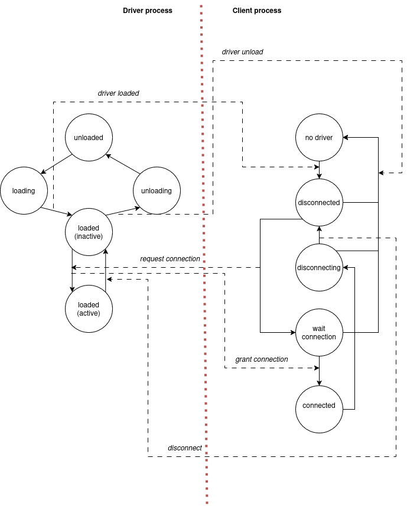

# Linux Kernel module verification

This document describes the current state of my attempt for Linux Kernel module
verification with Goblint.

## Problem statement
Linux kernel in ubiquitous in the modern computing, and verification of its code
base for absence of certain classes of bugs would bring immense benefits in
security, stability and development costs. Verification of the kernel source
code "as a whole" is unrealistic due to the sheer size and complexity, therefore
more modular verification approach needs to be taken. Linux kernel has modular
monolithic architecture, which presents the following implications on its
internals and feasible verification approaches:

* Parts of the Linux kernel are grouped into kernel modules. Each module is
  logically cohesive part of the kernel source code (in- or out-of-tree), which
  implements specific well-scoped functionality, and exposes it to the rest of
  the kernel using a well-defined interface. Modules can be statically linked
  into the kernel image, or loaded and unloaded dynamically. In the latter case,
  kernel tracks module dependencies and ensures that the module dependency graph
  is satisfied at any given point of time. Thus, modular verification approach
  might take advantage of module lifetime guarantees ensured by the kernel, and
  treat them assumptions without attempting to verify them.
* All parts of the Linux kernel run in the same privileged context: ring 0
  instructions available, shared address space, privileged access to the devices
  and other machine resources, etc. (note that here I consider FUSE, io_uring
  and the likes out of scope). Therefore, kernel module communication is not
  restricted to any specific protocol and can be performed using all available
  means of the C programming language, or even lower-level communication
  primitives. Implementation of machine-specific details is typically isolated
  into well-tested primitives available to the rest of the kernel, and
  verification of such primitives might pose a great challenge due to the need
  to define low-level model of target machine, while bringing limited benefits.
  Furthermore, many modules might not be concerned with machine specifics at
  all. At the same time, as with many other C programs, shared memory
  communication is ripe for verification for two reasons:

  * C programming language does not provide any means to protect its own
    abstractions, instead declaring all such breakages an "undefined behavior".
    As of version 6.14, Linux kernel code base has surpassed 40 million lines,
    from which absolute majority can potentially run in the same address space,
    and thus a bug in a single module can have unbounded impact on the rest of
    the system.
  * While the Linux kernel provides certain means to mitigate some risks in
    practice (e.g. using slab allocators, reference counting, RCU, implementing
    common data structures and synchronization mechanisms), shared memory
    communication between different parts of the kernel is still often based on
    atomics and widespread mutual exclusion primitives, that are hard to reason
    about and thus often result in data races. Given Linux kernel multithreaded
    nature, even parts of the same module can run concurrently. Furthermore,
    data races are typically hard to detect using usual testing techniques, as
    they are unstable and might manifest only in a very specific circumstances.
    Hence, data race verification within a module and between module boundaries
    becomes a focal point of shared memory verification.
* Despite potential diversity, many modules belong to specific classes (e.g.
  platform devices, character devices, block devices, etc.), where each class
  has a well-defined common interface to the rest of the kernel. That interface
  is seldom changed, so it can serve as a guide to verify many modules of the
  same class, and also to perform cheap incremental verification of modules
  between different kernel versions.

Considering the current state of affairs as outlined above, Linux kernel module
verification problem is formulated as follows:

> Scoped verification of individual kernel modules in isolation, where each
module is verified under the provided assumptions regarding its communication
with the rest of the kernel (environment). Such assumptions are referred to as
an environment model, which shall serve as a guide for the verifier, and is
manually defined by a domain expert. Environment model shall be flexible enough
to capture different classes of issues, with the primary focus on data races and
shared memory access issues in general, and provide the verifier with useful
invariants to avoid excessive false positives, while being simple enough to
define and refine manually. Ideally, environment models shall be adaptable to
the whole classes of modules to ensure cheap en-masse verification. In addition,
abstractions used for the environment models should be reusable in other
non-kernel contexts.

The rest of the document details my attempt to solve the stated problem. The
proposed solution is given under assumption that verification backend of
sufficient capability is available. All examples use Goblint as backend,
although proposed solution does not limit specific choices.

## Environment modelling
This section details on the abstraction used to model Linux kernel environment,
its rationale and provides more formal semantics for it.

### Worst-case scenario model
Prior to describing the actual proposed abstraction, defining a worst-case
baseline model might be worthwhile.

The central assumption of the worst-case scenario model is that the Linux kernel
provides no guarantees for run-time interaction between the environment and a
module. However, in order to make verification, the assumption shall be detailed
as follows:

1. The kernel module source code is executed in accordance with the C language
  standard of relevant version (C11 since Linux 5.18). In addition, should the
  module use any of language extensions implemented by the compiler, those
  should also be treated normally. This is the baseline for programming language
  semantics as used by the module.
2. Module execution adheres to the kernel memory model. Weakening the memory
  model would make safe implementation of various abstractions and algorithms
  impossible, and thus verification results for a module with weakened memory
  model would be practically useless.
3. Module has well-defined external interface and communication with the
  environment happens through that interface. External interface is defined here
  as functions and variables explicitly exposed by the module (either using,
  in-kernel builtin macros, function/variable pointers passed to the kernel,
  global functions and variables declared by C language means, etc.). This
  assumption is important, as enabling kernel to invoke arbitrary module
  functions and modify arbitrary data would lead to module inability to protect
  its own abstractions and thus render verification results useless too.
4. Environment interaction with module external interface is unbounded. The
  kernel is able to call any external interface function arbitrary number of
  times in arbitrary number of concurrently threads with any combination
  arguments, only bounded by function signature. Likewise, kernel can modify any
  external data concurrently, only bounded by variable type and qualifiers. No
  other run-time restrictions are imposed onto this interaction.

Proposed worst-case assumptions are minimalistic and only establish a baseline
for module execution: dropping any of the first three assumptions would make the
analysis meaningless, whereas the fourth assumption establishes the most relaxed
version of kernel-module communication possible. This set of assumptions shall
be sufficient to uncover any potential bugs in any module, as long as the
verifier is capable enough to do so.

From practical perspective, implementation of the worst-case scenario model is
limited to supplying the analyzer with a set of all external interface functions
as an entry points and instructing it that the entry points might run in
parallel.

At the same time, such worst-case assumptions are too weak and unrealistic. The
actual kernel provides much stronger guarantees for interaction with the module,
and furthermore, such guarantees are often module-specific. Programming under
this worst-case scenario model makes implementation of any sophisticated module
impossible, and bloats verification results with false positives --- a result of
analyzer failing to consider extended guarantees that the module relies upon.
Therefore, no further development of the worst-case scenario model will be done,
and its use is limited to an informal baseline.

### Process-based abstraction for environment modelling
Considering weakness of the worst-case scenario, some more practical model shall
be defined. This subsection will provide a detailed  rationale and informal
description of such model, and the next subsection will attempt more formal
specification.

That model shall be able to capture guarantees provided by the kernel to a
module, while not hiding potential bugs from the analyzer. The abstraction shall
be practical in a sense that experts in kernel programming should be able to
formulate module-specific models with limited effort. Having these basic
requirements in mind, let's analyze module role in the Linux kernel and
potential interactions between module and its environment:

* Absolute majority of the modules are well-scoped and their boundaries can be
  determined mechanically by scanning Linux kernel build artefacts. As part of
  the build process, kernel generates `*.cmd` files that contain information
  about build commands, their inputs and outputs. Full dependency graph can be
  derived from these files. Thus, for each module, a set of source files
  constituting its source code can be identified automatically. Certain backbone
  infrastructure of the kernel cannot be modularized, however, the proportion of
  such code is relatively low.
* Source files of each module can be analyzed using existing compiler
  infrastructure (e.g. Clang) to determine the external interface of the module,
  and its dependencies within the environment. The external interface
  declarations are subject to Linux kernel conventions. Typically, various
  macros and annotations (e.g. placing a symbol into specific object file
  section) are used to indicate that. Inference of external interface for a
  module is also predominantly mechanistic step, but in some non-conventional
  cases domain expert should have means to adjust the results.
* Module lifecycle is well-established and controlled by the kernel. Depending
  on the module type and build configuration, module can be either built into
  the kernel image, or compiled as a separate loadable file. For built-in
  modules, kernel defines specific initialization order. Loadable modules have
  lifecycle controlled by `init_module`/`cleanup_module` functions, module
  dependencies are explicit, and dependency graph is kept in a consistent state
  upon loading or unloading the module. Therefore, normal valid module lifecycle
  can be considered a reasonable assumption for module isolated verification.
* Other module-specific guarantees might also be present. Modules do not operate
  in isolation, and certain modules can rely on functionality of others for
  normal operation (e.g. other module might perform some lower-level bus
  management, while the first module operates a device over that bus). These
  guarantees are often implicit, inherently module-specific and cannot be
  formulated in a generic way as part of an abstraction. Instead, the
  abstraction shall provide means for domain experts to express such guarantees.
* In addition, Linux kernel concurrency model shall be taken into the account.
  Linux kernel architecture permits multi-threading and preemption, and code
  might run in several different execution contexts (e.g. during a syscall,
  hardware interrupt, kernel worker thread). Unless module takes some specific
  precautions to establish necessary guarantees (i.e. by disabling interrupts
  for some critical section), there can be no assumptions about concurrency. At
  the same time, exact set of concurrently executed code paths is also module
  specific, and thus the abstraction shall not limit model expression of it.

Based on the considerations outlined above, the following framework for
environment interaction modelling has been defined:

* Concurrency within the environment and module itself is expressed using a
  notion of process. An environment and the module are described by a set of
  processes, where each process represents an entity that might perform actions
  concurrently and semi-independently of others (with some limited
  synchronization as defined below). Here, "an entity" is used in the broadest
  possible sense: such entity does not need to exist as part of the module, but
  it could be, for example, a user-space program that issues syscalls and thus
  initiates some kernel-side action, or it can be kernel worker thread, hardware
  interrupt handler, etc. "An entity" does not need to exist continously (e.g.
  there might be several user-space applications sequentially issuing requests
  to some kernel resource, and exiting afterwards), the only requirement for it
  is that activities performed are in some way observable for the module or
  relevant environment, are not random and are governed by some hidden internal
  state, and changes in that state might be subject to synchronization with
  other "entities". To avoid further discussing any particular internal
  implementation details, entity behavior, activities and states are abstracted
  by a notion of process.
* Process in the model is assumed to exist for an indefinite time without
  terminating. No notion of global time exists, and apart from synchronization
  (as described below), processes cannot observe each other's local clocks. All
  processes are assumed to start at once at some point in the past. Intuitively,
  system startup can be considered such a point. This might not match the
  behavior of actual operating system processes that indeed have well-defined
  start times, and presumably terminate at some concrete point, with both start
  and termination times, in general, do not match with other processes. However,
  for purposes of generality such notion of a process is necessary. For
  instance, consider the following example: we might want to model two entities
  --- a kernel, that might load a character device module at some point, and a
  user-space program from time to time is willing to communicate with said
  character device. In such setting both "entities" indeed exist independently
  since the system has started (for purposes of analysis the fact that the
  user-space program has been started by the kernel shortly after system
  initialization is irrelevant as long as the character device module can be
  potentially loaded independently of that program startup), and both entities
  can also exist indefinitely until the system is shut down. Furthermore, both
  processes can enter "dormant" state (i.e. kernel not loading the module, and
  user-space program not trying to interact with the device) for unknown periods
  of time. Usual behavior of operating system processes can also be covered by
  proposed notion of process by defining some "pre-startup" and
  "post-termination" states for each process.

  Identification of relevant system entities and decomposition of those into a
  set of processes is performed by an expert based on domain-specific knowledge.
  
  Number of processes within the system is fixed at startup. This is an
  assumption made for practical implementation purposes. Reasoning about an
  infinite number of concurrent processes would require different approach with
  different trade-offs, and for now is considered out of scope. Upon composing
  the model, number of processes can be over-provisioned in order to cover most
  usage scenarios.
* Each process has a finite set of possible abstract states. Such abstract
  states do not need to match concrete entity states injectively, but for each
  concrete entity state there shall exist some abstract state that represents
  it. Thus, an abstract state of a process represents a possibly infinite group
  of concrete entity states that share some common property or provide an
  invariant relevant for particular kernel module verification. Such grouping
  shall be based on the actual nature of entity in question and cannot be
  generalized. As an example, consider aforementioned user-space program willing
  to communicate with character device. With respect to the kernel module
  controlling the device, the user program might be in 4 distinct states:
    * Disconnected --- when the program did not attempt to connect/open the
      character device or have already closed it, and instead performs some
      other activities. With respect to the kernel module, nature of such
      activities is completely irrelevant and thus any concrete program state
      that matches that description can be grouped into "disconnected" abstract
      state. Kernel module can stay in any possible state independently of
      disconnected program.
    * Connecting --- when the program has decided to make use of the device and
      requested corresponding handle from the kernel. Upon entering such state,
      the program shall perform a syscall(s), possibly asynchronously, and
      kernel shall respond in accordance with module readiness. While the kernel
      module can still stay in any possible state at this point, its readiness
      becomes relevant.
    * Connected --- the program has successfully acquired the handle and may
      freely operate on the character device. Again, any concrete activities of
      the program are abstracted out as long as it has capability to use the
      device. In this state, kernel module must stay loaded.
    * Disconnecting --- when the program decides to release the handle and
      notifies kernel of it. Program might perform some other irrelevant actions
      in this state and then independently transition back to disconnected
      state. Kernel module must still stay loaded until such release
      notification arrives.
  
  As it can be seen, a set of process abstract states might capture large
  swathes of concrete states for involved entities, and its granularity is
  subject to the actual underlying semantics. For instance, if kernel module in
  the example above could take distinct operation modes, set of user-space
  program states could have been extended to match that. From now on, concrete
  entity states will not be considered anymore, and abstract process states will
  predominantly be referred simply as "states".

  Naturally, transitions between states of a process can be modelled as a
  non-deterministic finite-state machine, which is also defined by an expert.
* Transitions between states might require some communication between processes.
  As could be seen in the example above, user-space program requires two-way
  communication with the kernel: to acquire the handle, user space program must
  make a request and receive a confirmation from the kernel, and after release
  the program notifies the kernel back. Nature of such communication for the
  underlying actual entities might be different: synchronous function calls,
  system calls, asynchronous network requests, etc., however the essence always
  stays the same: an entity transmits information representing the relevant
  aspects of its internal state to other entities, and requires the information
  from other entities in order to make certain changes in its internal state. At
  the same time, not every state change  requires inbound communication, and a
  process might be free to change its state as long as such change does not
  require any new information from other processes. Conversely, there exist
  changes in process' internal state that do not provide useful information to
  other processes and thus require no outbound communication. However, if a
  sequence of abstract states has no communication requirements, changes between
  these states are effectively unobservable to other processes, and
  distinguishing them might be irrelevant in current context.

  In order to model such communication, a notion of a message is being
  introduced. A message has no internal structure and within a model and is
  considered to be a primitive, fundamental and indivisible "piece of
  information" communicated between processes. Certain transitions within
  process' finite state machine might produce outbound messages, and others
  might require certain inbound messages to be received prior in order to
  perform the transition. Such messaging paradigm is rather general and matches
  well frameworks of fundamental works in the field of concurrency, e.g., those
  of Lesley Lamport. Messages are purely virtual concept of the model, and
  within real concrete system the communication might happen using other means.

  Actual semantics of messages is problem-specific and is defined based on
  process decomposition and finite state machines, however the core idea is that
  messages are a way for processes to observe changes in each other states
  relevant within verification context.
* Finally, to correlate the abstract process model to relevant concrete
  operations of underlying entities, a notion of an action is introduced. An
  action shall represent a fragment of code that performs some operation
  relevant in the verification context. Guided by other model elements defined
  above, a control flow graph of actions is composed, such that it covers all
  concrete execution scenarios for a module. Source code generated from such
  graph is referred to as a "harness". The verifier, guided by the harness,
  would employ abstract interpretation (or, potentially, other verification
  techniques) to detect issues in the code. An action is always attached to a
  transition in the process state machine, and is assumed to execute once the
  transition is taken. The purpose of action is "grounding" the process model
  into the actual execution environment, producing "a side effect" of process
  state changes.

  Even though there is direct correspondence between actions and transitions,
  there is also an important distinction. A transition is supposed to represent
  change in entity hidden state that is relevant for the verification task and
  thus warrants change in process abstract state. As processes cannot directly
  observe states of other processes, only produced messages, a transition is
  always considered atomic with sequential consistency guarantee across the
  system. Corresponding action, however, cannot assume that entities do not
  observe changes in hidden state. Furthermore, an action can include complex
  fragments of code that do unsynchronized reads, writes and perform side
  effects. Action is permitted to run indefinitely and concurrently with actions
  of other processes, with only restriction being that it should finish before
  process can take any further transition.

  For practical purposes of kernel module verfication, most actions' code
  fragments would essentially be limited to invoking functions from the module
  external interface.

Summing up the presented abstraction, it represents kernel module and
environment as a fixed set of communicating non-deterministic finite-state
machines, grounded into the execution environment via actions. The state
machines essentially serve as schedulers for concurrently running code fragments
of actions.

#### Extra assumptions of consistence and scheduling
The abstraction, informally described above, has two additional assumptions
necessary to make analysis feasible. Both requirements are predominantly
necessary to avoid explosion of system abstract states.

1. "Sequential consistence of the abstraction" -- at any given point of time,
   the abstract system as a whole has well-defined conherent state. That is, at
   any given point of time abstract process states and communications are
   well-defined, and the abstract system has complete information in that
   regard. Furthermore, any changes to the abstract state are atomic. Hence, the
   abstract system state is sequentially consistent -- there is always some
   linear trace of states representing current global history of a system. Note
   that this requirement only applies to abstract states and is necessary to
   efficiently explore abstract state space, whereas concrete states have more
   relaxed synchronization requirements limited to acquire/release semantics on
   hidden state changes that correspond to message-based communication of the
   abstract state machine.
2. "Fair scheduling of processes" -- every process is scheduled fairly. That is,
   if there is a message in process mailbox, it is guaranteed to get a slice of
   time to perform transition, at least before sender of that message gets to
   send something else to that particular process. From system perspective,
   message delivery is asynchronous, and sender process is allowed to proceed
   with something else after the message has been sent, as long as the receiver
   timely consumes the message. If sender attempts to transmit another message
   before that, it'll "block" (from finite state machine perspective, transition
   that would transmit that message is not considered until potential receiver
   has processed the previous message). Note that this requirement is only
   necessary to avoid infinite explosion of system abstract states, where some
   process in a loop sends messages while receiver is starved and does not
   process those. The messages are purely virtual concept of the model, and thus
   underlying concrete system has no inherent fair scheduling requirement.

#### An example of process-based model

The process set presented on the figure 1 models TTY printk driver. The driver
consists of two processes: a "driver" process that represents kernel loading and
unloading the driver, and "client" process that represents some in-kernel users
of the module trying to acquire TTY handle and write to the TTY. The client
process is a slightly more sophisticated version of the example discussed in the
descripton above. The driver represents relevant states of the module with
respect to the rest of the kernel, and it also needs to track activity of each
individual client (in that particular case, a single client). The diagram shows
relevant communications between processes. Note that this communication is
purely virtual, abstract artefact of the process model. Actual interaction is
performed by action code fragments (not shown on the pictures) which peform
synchronous `init_module`/`cleanup_module` calls on the driver side, and
`open`/`write`/`close` on the client side.

This model has been sucessfully used to demonstrate Goblint's capability to
detect (deliberately introduced) data races in the `ttyprintk` kernel module
without producing false positive data race warnings.

### More formal description of process-based model
This subsection attempts a more formal definition of process-based model defined
above. Given the fact that proposed abstraction essentially constitutes a
"grounded" communicating non-deterministic finite-state machine, the description
might be partially reformulated based on this mathematical concept.

In a system consisting of $N$ processes, $n$-th process' is denoted as $P_n \in
\mathbb{P}$. $P_n$'s behavior (protocol) is defined by a tuple $(S_n, s_n^0,
A_n, M_n^{\uparrow}, M_n^{\downarrow}, \delta_n)$ where:

* $S_n$ --- a finite non-empty set of $P_n$ states.
* $s_n^0 \in S_n$ --- an initial state of $P_n$.
* $A_n$ --- a finite set of action that $P_n$ can initiate, including a no-op
  action $\varnothing$.
* $M_n^{\uparrow}$ --- a finite set of messages that $P_n$ can send.
* $M_n^{\downarrow}$ --- a finite set of messages that $P_n$ can receive.
* $\delta_n: S_n \times M_n^{\downarrow \varnothing} \rightarrow \mathcal{P}(S_n
    \times \mathcal{P}(O_n) \times A_n)$ --- a finite state machine transition
    function for $P_n$, where $M_n^{\downarrow \varnothing} = M_n^{\downarrow}
  \cup \{\varnothing\}$ represents an inbound message (possibly none), and $O_n$
  is a finite set of $(P_r, m)$ pairs such that $P_r \in \mathbb{P} \wedge P_r
  \neq P_n \wedge m \in M_n^{\uparrow} \wedge m \in M_r^{\downarrow}$ --- pairs
  of outbound messages such that the message receiver is not the same process
  $P_n$. The function essentially states that for every combination of $n$-th
  process state and some (or none) message, there is a (possibly empty) set of
  transitions, where each transition is characterized by a target state,
  (possibly empty) set of outbound messages and an action to be taken.

At any given point of time $t$, complete state of $P_n$ is characterized by a
tuple $P_n^t=(s_n^t, b_n^t)$:

* $s_n^t \in S_n$ --- state of $P_n$ finite state machine.
* $b_n^t$ --- a set of received messages (a mailbox), containing $(P_o, m)$
  pairs, where $P_o \in \mathbb{P} \wedge P_o \neq P_n$ is the origin (sender)
  process, and $m \in M_n^{\downarrow} \wedge m \in M_o^{\uparrow}$.
  Furthermore, $\forall (P, m) \in b_n^t \nexists (P_2, m_2) \in b_n^t: P = P_2
  \wedge m \neq m_2$, that is, there is at most one message coming from any $P$
  in the mailbox at any point of time.
* $\Delta(s_n^t, b_n^t) = \{(s_n^{t+1}, b_n^t \setminus (P_o, m), a, O_n^t) |
  (P_o, m) \in (b_n^t \cup \{\varnothing\}) \wedge (s_n^{t+1}, O_n^t, a) \in
    \delta_i(s_n^t, m) \wedge \forall (P_r, *) \in O_n^t \nexists (P_{ro}, *)
    \in b_r^t: P_{ro} = P_n\}$ --- process transition function for process state
    and mailbox. In essence, given process state $s_n^t$ and mailbox $b_n^t$, it
    produces a set of possible transitions defining the next state $s_n^{t+1}$,
    updated mailbox $b_n^{t+1}$ (with removed $m$), action $a$ and a set of
    outbound messages $O_n^t$. The transition must consider all available
    messages in the mailbox plus "no message"; for each message $m$, $s_n^{t+1}$
    and $O_n^t$ shall come from $\delta_n(s_n^t, m)$. Furthermore, for
    particular transition to be possible, all receivers of its outbound messages
    shall have no pending messages from the $P_n$.

Complete system state at time $t$ is characterized by a tuple
$\mathcal{S}^t=(P_1^t, ..., P_N^t)$:

* $\mathcal{S}^0=(P_1^0,...,P_N^0)$, where $\forall P_n \in \mathbb{P}:
  P_n^0=(s_n^0, \emptyset)$ --- initial system state at $t=0$.
* $\mathfrak{D}(\mathcal{S}^t = P_1^t, ..., P_N^t) = \mathcal{S}^{t+1} =
  \{((U(P_1^t, i, P_i^{t+1}, O_i^{t}), ..., U(P_N^t, i, P_i^{t+1}, O_i^{t})), a)
  | P_i^t \in S^t \wedge (P_i^{t+1}, a, O_i^{t}) \in \Delta(P_i^{t})\}$ where
  $$U(P_x^t, i, P_i^{t+1}, O_i^t) = \begin{cases} P_i^{t+1}& \text{ if } x = i
  \\
  (s_x, b_x \cup \{(P_i, m) | (*, m) \in O_i^t\}) \text{ where } (s_x,
  b_x)=P_x & \text{ otherwise} \end{cases}$$ --- system transition function,
  which considers all possible process transitions (as defined by $\Delta$) for
  all processes, and for each possible transition does an update $U$ of system
  state. The update is done by replacing $P_i$ state with the new one, and
  extending other processes' mailboxes with messages sent to them. The result is
  a set of tuples containing next system state and an action.

#### Interpretation
The formal description defined above can be interpreted as construction of a
product automata combining all process' states into a product states of
non-deterministic finite state machine which are explored one transition at a
time (i.e. one step of product automata always corresponds to one process making
a transition). Such a construct satisfies sequential consistency requirement
defined above. Additional constrints placed in mailbox states (namely, that
mailbox may never contain more than one message from the same sender) ensure
that fair scheduling requirement is satisfied too.

Exhaustive exploration of such product automata is essentially equivalent model
checking for process abstract states that might occur simultaneously within a
running system. Assume that $\mathbb{S} = P_1 \times ... \times P_N$ is a set of
all process state combinations, and $\mathbb{S}_R \subseteq \mathbb{S}$ is a set
of reachable states determined by model checking, it is possible to determine
mutuall exclusive ($M_x$) states between any pair of processes $(P_x, P_y)$:
$$M_x(\mathbb{S}_R, P_x, P_y) = \{ (s_x, s_y) | s_x \in S_x \wedge s_y \in S_y
\wedge (s_x, s_y) \notin M_i(\mathbb{S}_R, P_x, P_y) \}$$ where
$$M_i(\mathbb{S}_R, P_x, P_y) = \{(s_x, s_y) | (..., (s_x, b_x), ..., (s_y,
b_y), ...) \in \mathbb{S}_R \}$$

### An alternative view on formalizing the model
As opposed to model checking based aproach described above, another
formalization closer to the Petri nets can be developed. The core idea of this
approach is treating the process set as a single graph (Petri net) without
instantiating a product automata. Within such Petri net, process transitions are
represented as network transitions, inter-process messages --- as markers, and
Petri net places regulate communication requirements of process state
transitions (i.e. transitions requiring inbound messages have multiple Petri net
places connected to them). Author did not work on this idea any further, so
concrete formalization is absent at the moment.

## Algorithms for the process-based environment model
This section details on certain useful algorithms based environment model as
defined in the previous section.

### Agglomerating mutual exclusion pairs
Previous section has shown that it is trivially possible to determine a set of
mutually exclusive state pairs $M_x$ for any pair $(P_x, P_y)$, given an
exhaustive set of reachable states obtained via model checking. Such pairwise
mutual exclusion, however, does not account for process state transitions, which
is important in practical verification. If we instantiate a mutex within a
harness for each such pair of mutually exclusive states, it creates excessive
amount of mutual exclusion considerations and puts a strain on the verification
backend. Instead, known mutual exclusion pairs can be agglomerated to reduce the
total number of mutexes. Consider an example a pairwise mutual exclusion set
$\{(s_{x,1}, s_y), (s_{x,2}, s_y)\}$ --- it can be transformed into an
equivalent $\{(\{s_{x,1}, s_{x,2}\}, s_y)\}$, thus resulting in a single mutex
instead of two pairwise mutexes. In practice, such agglomerated mutual exclusion
also appears more "meaningful" to a human reader.

To define the algorithm, a notion of a "mutual exclusion segment" is introduced:
a mutual exclusion segment $\mathcal{M}$ is a set of $(P_x, s_x)$
(process-state) pairs where $P_x \in \mathbb{P} \wedge s_x \in S_x$ with mutual
exclusion condition $$\forall (P_x, s_x), (P_y, s_y) \in \mathcal{M}: (s_x, s_y)
\in M_x(\mathbb{S}_R, P_x, P_y)$$ --- all pairwise combinations of process
states within a segment are mutually exclusive with respect to reachable system
states.

Each segment corresponds to a mutex in the harness code. It shall be noted that
any mutual exclusion pair from $M_x(\mathbb{S}_R, x, y)$ is a segment itself,
and set of all mutual exclusion segments derived from $\mathbb{S}_R$ is denoded
as $\mathbb{M}_0$. Thus the goal of agglomeration algorithm is to produce some
$\mathbb{M}'$ such that $|\mathbb{M}'| < |\mathbb{M}_0|$ without violating
soundness. In this context, soundness means that the set of system states
$\mathbb{S}_x$ permitted by $\mathbb{M}'$ shall cover all $\mathbb{S}_R$ (i.e.,
$\mathbb{S}_R \subseteq \mathbb{S}_x$) --- there shall be no system state
permitted by the original segment set that is prohibited by the agglomerated
set. Ideally, $\mathbb{S}_x = \mathbb{S}_R$ shall hold --- the agglomerated set
shall permit exactly the same set of system states to avoid false positives
during the analysis. There might be multiple possible ways to agglonerate sound
$\mathbb{M}'$, and finding the most optimal one could be computationally
costly, and thus finding some local optimum for $\mathbb{M}'$ is considered
sufficient.

The agglomeration algorithm is first executed on per-process basis, and then all
discovered segments are merged into $\mathbb{M}'$ and pruned. The per-process
part for $P_x$ is defined below:

0. Preparation step --- given a set of all mutual exclusion pairs, for each
   state of $P_x$ determine other process states mutually exclusive with it.
   That is, define a mapping $E(s_x) = \{(P_y, s_y) | P_y \in \mathbb{P} \wedge
   P_x \neq P_y \wedge (s_x, s_y) \in M_x(\mathbb{S}_R, P_x, P_y)\}$.
1. The first stage of the algorithm is executed iteratively until fixpoint is
   reached (i.e. until segments do not change after an iteration). The algorithm
   state is a mapping between process states and sets of mutual exclusion
   segments $\mathcal{A} = S_x \rightarrow \mathcal{P}(\mathbb{M})$, where
   $\mathbb{M}$ is the set of all possible $\mathcal{M}$ (note that at this step
   $\mathbb{M}$ is not required to be sound with respect to $\mathbb{M}_0$). The
   initial algorithm state is $\mathcal{A}^0 = \{ s_x^0 \mapsto \{E(s_x^0)\} \}$
   --- the initial process state corresponds to a single segment encompassing
   all its mutual exclusion counterparts from the other processes, no other
   state $P_x$ present in the mapping.

   Iterative step refines the algorithm state by iterating on all reachable
   process states $s_x$ (individual state reachability is also deduced from
   $\mathbb{S}_R$). The core idea is iterative propagation of mutual exclusion
   segments across the process finite state machine with increasing granularity.
   For each reachable state $s_x$:

   1. Collects all "surrounding" segments $\mathcal{M}_S \in \mathbb{M}_S$. For
      a state $s_x$, surrounding segment $\mathcal{M}_S$ is a mutual exclusion
      segment of either its direct precesessor, or direct successor state of the
      finite state machine (with an exception for the initial state --- for it,
      only the successors are considered under assumption that upon process
      start the entry state cannot "inherit" any locked mutexes from predecessor
      state, as there is no predecessor) intersected with $E(s_x)$. Only
      non-empty intersections are collected.

      $$\mathbb{M}_S = \begin{cases} \bigcup\limits_{}^{s \in
      succ(s_x)}\{\mathcal{M}_S \cap E(s_x) | \mathcal{M}_S \in
      \mathcal{A}^i(s)\} \
  & \text{ if } s_x = s_x^0 \\
  \bigcup\limits_{}^{s \in succ(s_x) \cup pred(s_x)}\{\mathcal{M}_S \cap E(s_x) | \mathcal{M}_S \in \mathcal{A}^i(s)\} & \text{
  otherwise} \end{cases}$$ where $succ(s_x)$ and $pred(s_x)$ are successors and
  predecessors of finite state machine state $s_x$, respectively.
   2. Set of "covered" mutually exclusive states $\mathcal{M}_C$ is collected
      --- an intersection between $E(s_x)$ and the union of collected
      surrounding segments $\mathbb{M}_S$. $$\mathcal{M}_C = E(s_x) \cap
      (\bigcup\limits_{}^{\mathcal{M} \in \mathbb{M}_S}\mathcal{M})$$
   3. Finally, if the set of covered mutually exclusive states does not fully
      match $E(s_x)$, another segment representing the difference is
      constructed. Algorithm state mapping for state $s_x$ is updated to contain
      collected surrounding segments plus the final difference segment, if it
      was constructed.

      $$\mathcal{A}^{i+1}(s_x) = \begin{cases} \mathbb{M}_S \
  & \text{ if } \mathcal{M}_C = E(s_x) \\
  \mathbb{M}_S \cup \{E(s_x) \setminus \mathcal{M}_C\} & \text{ otherwise}
  \end{cases}$$
2. The second stage splits resulting segments on per-process basis. This is done
   simply by iterating segment set for each state and splitting each segment it
   into per-process subsegments. That is, $\mathcal{A} = S_x \rightarrow
   \mathcal{P}(\mathbb{M})$ mapping is refined such that each segment represents
   mutually exclusive states for some particular process.

   $$\mathcal{A}'=\{s \mapsto split(\mathbb{M}_s) | (s, \mathbb{M}_s) \in \mathcal{A}\}$$
   where $split(\mathbb{M}_s)$ is function on the segment set such that

   $$\forall \mathcal{M} \in split(\mathbb{M}_s) \exists P_y \in \mathbb{P}: P_x
   \neq P_y \wedge \forall (P, *) \in \mathcal{M}: P = P_y$$
   
   (Read the rest of the algorithm before getting back here). Rationale for that
   is eliminating unsound mutual exclusion from the segments produced by the
   previous step. Secondary goal is better matching segments between processes
   later. Consider the example: there is a driver process $D$ and two clients
   $A$ and $B$ that in some states are mutually exclusive with some states of
   $D$ (exact states are omitted for clarity), but are not synchronized with
   each other. If we have skipped splitting (but done the rest of the
   algorithm), we would obtain mutual exclusion segment $ABD$ for driver and
   $AD$ and $BD$ for clients, respectively. Firstly, the driver segment is
   unsound, as it specifies mutual exclusion between $B$ and $D$, where there is
   none. Secondly, it is not clear how mutex representing $AD$ or $BD$ relates
   to $ABD$. Now, by splitting driver segment into $AD$ and $BD$ subsegments, we
   eliminate unsoundness --- there is no more mutual exclusion between $A$ and
   $B$ while their mutual exclusion with $D$ has been preserved --- and also
   produce direct correspondence between driver and clients' segments.
3. Finally, we iterate the $\mathcal{A}=S_x \rightarrow \mathcal{P}(\mathbb{M})$
   mapping and produce a reversed mapping $\Bar{\mathcal{A}} = \mathbb{M}
   \rightarrow \mathcal{P}(S_x)$ --- we determine which process states have
   identical segments and collect these states. Then, for each pair of that
   reversed mapping, obtain the $P_x$ part of the agglomerated segment set
   $\mathbb{M}({P_x}) = \{\mathcal{M} \cup \mathbb{S}_x\ | (\mathcal{M} \mapsto
   \mathbb{S}_x) \in \Bar{\mathcal{A}}\}$. Each segment of $\mathbb{M}({P_x})$
   represents pairwise mutual exclusion between two processes, such that within
   the segment each state of one process is mutually exclusive with all other
   included, and one of the processes is $P_x$.

Once $\mathbb{M}({P_x})$ have been obtained for all $P_x \in \mathbb{P}$, the
agglomerated segment set is constructed:

$$\mathbb{M}' = \bigcup\limits_{}^{P_x \in \mathbb{P}} \mathbb{M}({P_x})$$

As a result of proposed algorithm, we obtain a set of mutual exclusion segments
$\mathbb{M}'$ that covers pairwise mutual exclusion for all processes within a
system. Additional pruning can be introduced to minimize the size of that set.
Pruning is performed iteratively until fixpoint is reached (i.e. until the set
of segments does not change); there are two types of pruning:

1. "Inclusion pruning" scans $\mathbb{M}'$ for segment pairs $(\mathcal{M}_1,
   \mathcal{M}_2)$ such that $\mathcal{M}_1 \subseteq \mathcal{M}_2$. In that
   case, $\mathcal{M}_1$ is considered redundant and dropped.
2. "Overlap pruning" scans for segment pairs, for which the difference between
   segments includes only one process' states. In that case, all intersecting
   states for that process are removed from one of the segments. Thus, that
   segment is partially pruned. For a pair of segments $(\mathcal{M}_1,
   \mathcal{M}_2)$ overlap pruning is defined as:

   $$ \exists P_a \in \mathbb{P}: (\forall (P_y, s_y) \in (\mathcal{M}_1 \Delta
    \mathcal{M}_2): P_a = P_y) \wedge \mathcal{M}_1' = \mathcal{M}_1 \setminus
    \{(P_y, s_y) \in (\mathcal{M}_1 \cap \mathcal{M}_2) | P_y = P_a \} $$
   
   The intuition here is as follows: considering the fact that all segments
   cover exactly a pair of processes, and for one of the processes two segments
   match exactly in covered states, it should be safe to remove intersecting
   states of the other (non-matching) process from one of the segments, because
   they are fully covered by the other segment anyway.

While proposed algorithm with pruning does not guarantee reaching global minimum
in the number mutual exclusion segments, in practice it has shown to generate
"reasonable" $\mathbb{M}'$'s.

### Constructing control flow graph
Construction of a control flow graph is necessary to produce a concrete harness
for analysis and verification. As a side product, the harness might be actually
executable when compiled, however, this property is subject to the content of
particular actions included into the environment model. Thealgorithm presented
here constructs unstructured control flow graph (i.e. based on conditional
statements and goto's), as it is completely sufficient for Goblint analysis. As
of now, the description of the algorithm is purely informal and relies on
intuitive understanding of the process-based environment model

Prior to presenting the algorithm, necessary control flow nodes are defined:

* Statement node --- represents an action of the environment model.
* Sequence node --- represents a sequence of control flow nodes.
* Branch --- represents a non-deterministic branching between multiple possible
  control flow nodes.
* Labelled node --- represents a control flow node with a label attached.
* Goto node --- represents a goto statement with some labelled node as a target.
* Synchronization node --- represents a compound operation that locks and
  unlocks certain mutexes (provided as parameters), and in case of failure
  optionally gotoes (does rollback) to some labelled node.
* Initialization barrier --- special node used to ensure that all processes
  start at the same time (as required by the abstraction previously defined).

Necessary set of nodes is quite minimal and should map well onto any imperative
language that features unstructured control flow, inter-process synchronization
and randomness.

In addition, a canonicalization operation is defined. For all nodes except
sequence, canonicalization is simply performed recursively on all subnodes. For
sequence node, after recursively canonicalizing all subnodes, nested sequence
nodes are flattened into the parent sequence. The canonicalization is necessary
to improve readability of generated code and does not impact its semantics.

The algorithm for constructing control flow node from the process state machine
is the following:

0. Global preparation step --- construct mutual exclusion segments $\mathbb{M}'$
   using the algorithm from the previous subsection.
1. Per-process preparation --- perform graph search on the process state
   machine, keeping track of current path. For each encountered state, generate
   a unique label and remember it. For each backedge (i.e. edge to some state
   that is already in the current path), save it into a set of backedges.
2. The rest of the algorithm is performed recursively, keeping track of states
   that have been processed already. The first iteration is starts with the
   entry state of the process FSM.
3. We gather all outgoing edges for a state, and for each edge generate a
   control flow node as follows:

   1. If it is a backedge, or if the recursive algorithm has already encountered
      edge target state, create a sequence of two nodes: a statement node for an
      action corresponding to the edge, and a goto node for the label of edge
      target state.

      Otherwise, create a sequence of two nodes: a statement node for an action
      corresponding to the edge, and a node produced by recursive call to the
      step 2 of the main algorithm for edge target state.
   2. Determine mutexes held by the source and target states of the edge, these
      are "unlock" and "lock" mutex sets, respectively. Determine intersection
      between these sets, this is "hold" mutex set. Remove the intersection from
      both "unlock" and "lock" sets. If any of these sets is non-empty, add
      synchronization node to the beginning of the sequence with the rollback
      label being the label for the source state of the edge.
4. If there are multiple outgoing edges, construct a branch node. Otherwise, use
   the edge node verbatim.
5. Wrap the result with a labelled node corresponding to the precomputed label
   for the state.
6. Once the recursion has ended, wrap the top-most control flow node
   (corresponding to the process FSM entry state) into a sequence. Prepend a
   synchronization node with the "lock" set corresponding to the entry state
   mutual exclusion segments, and an initialization barrier node.

Using the proposed algorithm, an unstructured control flow corresponding to a
process non-deterministic state machine is produced. Generating harness source
code from these control flow nodes should be trivial for most imperative
languages. Furthermore, generated control flow is agnostic to execution or
analysis environment.