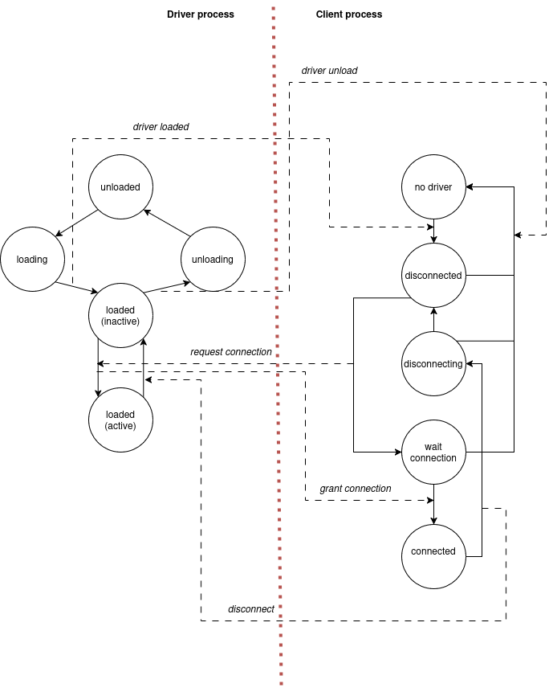
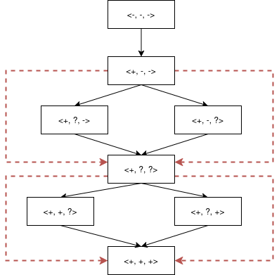

# Linux Module modelling as concurrent processes
This document describes a prototype of a concurrent process model to represent
and approximate an interaction between Linux kernel module and the rest of the
kernel (the environment). This approximation is necessary to explore
interactions between module and its environment, identify potentially
problematic execution paths and drive kernel module verification.

## Notes on kernel module identification and isolation
Prior to introducing concurrent process model, Linux kernel modules need to be
identified and isolated:
1. Identification process is rather mechanistic and does not require any human
   insights. Upon build, Linux kernel generates a set of `.cmd` files for each
   target (object file, module file, etc.). These files contain target name and
   build command. A script provided in this repo (see `compile_db`) is able to
   parse and index these files to identify a complete set of kernel modules and
   their dependencies. Thus, for each module, a set of source files representing
   the module can be determined automatically.
2. Module isolation process is semi-automatic and requires manual work. It
   consists of two parts. Firstly, a script (see `stub_generator`) is used to
   scan Linux kernel module source files identified by the previous step, and
   extract declarations of all undefined symbols (external functions and
   variables). The script generates a single "stub" file, which user then is
   supposed to fill in with definitions appropriate for the problem. Some
   definitions (e.g. locking, I/O, etc.) are generic and can be shared between
   different modules, however a significant part is unique. Certain functions
   (e.g. builtins, locking) will be provided by the verifier and thus are
   excluded from the stub.

As a result, each kernel module can be identified and isolated to represent a
self-contained unit ready for verification.

## Harness for verification
In simplest cases, verification harness can implemented manually simply by
providing a main function as part of stub file. The main function is supposed to
drive the module, simulating the interaction between a module and the rest of
the kernel. This approach, however, is problematic for two reasons. Firstly,
implementing such harness manually is tedious and work-intensive. Secondly, such
manual harness will most probably cover only some particular usage scenarious
and won't expose many problems within the module.

Therefore, it was decided to introduce an abstraction that represents
interactions between a module and its environment. The abstraction can be then
used to generate more robust harness for verification, or explored on its own to
identify potentially problematic execution paths.

### An example module: TTY printk
Prior to introducing the abstraction, an example module will be described
informally.

TTY printk kernel module (`drivers/char/ttyprintk.c`) implements a character
pseudo-device that enables used to "make printk messages". The module is fairly
simple, yet it includes potentially-concurrent routines that need to be verified
for race conditions, thus making it a good use case. The module `init` function
allocates a TTY driver and provides a few TTY operations: open, close, write and
hangup, as well as port shutdown operation. Among those, write and port shutdown
operations are potentially-concurrent and thus are protected by spin-locks. Both
operations use module-internal routines that ultimately rely on kernel `printk`
function for output. That function shall be provided as part of module stubs,
and shall expose potential race conditions, e.g., by accessing a non-atomic
static variable.

The module itself can have multiple concurrent clients (i.e. users of the
pseudo-device), that independently open, write and close their devices. At the
same time, the module relies on certain kernel guarantees. For instance, kernel
makes sure that no module functions are exposed to the outside environment prior
to module initialization procedure (which "publishes" the functions by filling
in approariate descriptior structure fields).

### Concurrent state machines with message passing
The abstraction for the harness shall be generic enough to represent a variety
of interactions between concurrent execution paths (processes/threads), yet
simple enough to hide internals of module and kernel implementation, exposing
only relevant interactions between module and its environment. To accomplish
that, the following design was chosen.

Units of concurrent execution are referred to as processes (this name does not
reflect the internal implementation details. For instance, such processes might
run in the same execution context and share the same memory space). All
processes are assumed to start simulatenously at some point of time, and run
indefinetely (i.e. with respect to an observer, process never terminates,
although it might stay in some "final" state for an infinite period of time).
Should there be any need to introduce an additional sequencing between processes
(e.g. `pthread_create`/`pthread_join` from the main thread), synchronization (as
described below) shall be used to simulate that. Reason for that decision is
that simplifies process internals (there is no need for special `spawn`/`join`
primitives in the abstraction), and it also aligns well with the real world of
Linux kernel modules (e.g. both TTY printk module, and its clients exist
indefinitely before module gets loaded and clients begin interaction with that.
Clients do not get "spawned" once module gets loaded, they are independent
entities). Number of processes is constant throughout the system execution.

Each process is represented by a non-deterministic finite state machine. States
themselves are scalar and do not contain any additional information. Transitions
between states can be non-deterministic from an observer perspective. Process
has a single well-defined initial state, and from there it can proceed by
executing finite state machine indefinitely. For analysis purposes, neither
states, nor transitions carry any additional semantics (apart from messaging
described below). For harness code generation purposes, code snippets can be
attached to states and transitions, but those are fully transparent and do not
influence this abstraction in any way. Process represents and abstracts the
state of some concurrently executing entity within kernel module or its
environment. A complete set of processes is referred to as "system (of
processes)".

Process state machines described above, however, are insufficient on their own.
If we consider each process to be running independently, then such a model will
quickly run into invalid states that are not possible in reality, yet prevail in
the model. The number of false positives during analysis will be overwhelming,
and analysis results will be too noisy for consideration. As mentioned
previously, kernel actually provides certain guarantees for the interaction
between module and its environment. The simplest example is module
loading/unloading -- kernel won't permit actual uses of the module until it has
been loaded, and won't permit unloading until all references to the module has
been dropped. This immediately shows that a significant part of system state
space, where there are active clients with unloaded module, shall simply be
dropped and never considered by the analyzer -- the real kernel will never get
into these states. This, of course, is done under assumption that kernel indeed
fulfills such invariants, and verification of that fact is out of scope for this
abstraction.

Thus, set of state machines representing the system shall be augmented with some
notion of mutual exclusion. For purposes of this abstraction, message passing
has been selected for that role. Reasons for that include the fact that message
passing is a classic technique of inter-process communication, used in some
foundational works on the topic (e.g. Leslie Lamport publications). Message
passing is generic enough to represent any potential synchronization construct
(mutexes, atomics, monitors), yet it does not imply any machine-specific
semantics or restrict underlying synchronization protocols.

Within the system of processes, messages are scalar and are used to restrict
potential state machine transitions. Each process is augmented with a "mailbox"
-- a set of message-sender pairs for messages that the process has received by
certain point of time. Each state machine transition can have an associated
"trigger" -- a message that is required to be present in the mailbox for
transition to happen. If such transition happens, respective message is erased
from the mailbox. In addition, each transition can have a set of associated
outbound messages: once the transition happens, these messages are delivered to
other processes. Outbound message set stays immutable for the whole duration of
system run. There are no dedicated communication channels, each process has only
one mailbox. Therefore, processes obtain a primitive to synchronize their
execution and avoid getting the system into invalid states. It shall be noted
that the messaging is only used to simulate invariants external to the module,
whereas mutual exclusion constructs within the module are subject to
verification and thus shall not be restricted by the model. Furthermore, system
state now includes mailbox (e.g. system states where some process has identical
state machine yet different mailbox contents are considered different).

However, there are some system-wide assumptions that restrict process states and
messaging:
1. "Sequential consistence" -- at any given point of time, the system has
   well-defined conherent state. That is, at any given point of time process'
   states and mailbox contents are well-defined, and all processes posess
   complete and identical information in that regard. Furthermore, any changes
   to the system state (e.g. process transitioning into new state and
   consuming/delivering messages) are atomic. Hence, the system state is
   sequentially consistent -- there is some linear trace of states representing
   global history at any given point of time. Note that this requirement only
   applies to abstraction states, whereas real harness actions associated with
   abstraction transitions can and should run concurrently (with an assumption
   that for every process, any action initiated by the previous state transition
   has been finished before the next transition happens). This requirement is
   necessary to avoid explosion of system states even for trivial models.
2. "Fair scheduling" -- every process is scheduled fairly. That is, if there is
   a message in process mailbox, it is guaranteed to get a slice of time to
   perform transition, at least before sender of that message gets to send
   something else. From system perspective, message delivery is asynchronous,
   and sender process is allowed to proceed with something else after the
   message has been sent, as long as receiver timely consumes the message. If
   sender attempts to send another message before that, it'll "block" (from
   state machine perspective, transition that would deliver that message is not
   considered until potential receiver has processed previous message). This
   requirement is necessary to avoid infinite explosion of system states, where
   some sender in a loop sends messages while receiver is starved and does not
   process those (e.g. consider a case where driver process is loaded and
   unloaded in an infinite loop, while clients are simply dormant). This
   requirement can be relaxed if mailbox contents are excluded from system state
   (i.e. system states with identical process state machines but different
   mailbox contents would be considered identical).

### An example model: TTY printk
Now, an abstraction described above will be applied to describe TTY printk
module interactions with the rest of kernel. The module is modelled as follows:
there is a single driver process and N client processes. The driver can be in
`unloaded`, `loading`, `unloading`,  and `loaded` states. The last driver state
is actually expanded into a set of states that trace each client (e.g. `loaded
(inactive)`, `loaded (active)` for a single client system) -- this is necessary
because the driver process shall track client states and can only beging
unloading when it has no active clients. The client can be in `nodriver`,
`disconnected`, `disconnecting`, `wait connection` and `connected` states.
Client has no need to track other clients, but needs to track driver state.
Transitions and messaging of that system for a single client case are presented
on the picture below (note that each state has a self-loop, which is omitted for
clarity; transition names are also omitted, but should be self-explanatory):


The model above represents a single client case. For multi-client
configurations, each client state machine stays the same, whereas in the driver
`loaded (inactive)` and `loaded (active)` states are expanded to reflect all
client state combinations. Furthermore, client `request connection` messages are
specialized so that driver "knows" which client requests a connection. From
modelling perspective such expansion is almost mechanical, and the full set of
process states is expanded automatically. In fact, it is quite easy to make the
model generator parametric with respect to the number of clients.

The main invariant that the model above preserves is that no client can be in
`connected` state, while the driver is `unloaded`.


### Harness generation approaches
#### Notes on code generation
For code generation purposes, the model can be expanded with a set of C code
snippets, corresponding to each transition in each process, plus one snippet per
process to perform initialization. Code snippets can be templates (useful for
multi-client models, where each client is supposed to behave slightly
differently, e.g. use different write batch sizes).

#### Harness implementation
With the model above, several approaches to generate harness has been tried:
1. Approximate each process as an independent thread with its own state machine,
   synchronize processes using a set of mutexes/atomic global variables to
   represent system state. While this is the easiest and most obvious approach,
   I have found it impossible to teach Goblint that certain system states are
   mutually exclusive for such state machines. Due to over-approximation,
   Goblint was either investigating false positives, or assuming that deadlock
   happens and no state besides the inital is reachable. Communicating the
   intent of the model to Goblint did not seem to be possible.
2. Implement a scheduler in the main thread, spawn helper threads only to
   perform concurrent actions. While this approach appears more promising, it
   still seems too generic for Goblint to comprehend baken-in invariants.
3. Generate a set of traces from the product automata (i.e. complete an automata
   representing a complete state space for the system) and run Goblint
   independently on these traces. This should be the easiest to analyze, however
   the problem is that even in a simple system of a driver and few clients,
   total number of possible traces is prohibitively large. Certain "interesting"
   traces shall be identified for further analysis with Goblint.

#### Identification of "interesting" traces
To identify "interesting" (that is, prone to race conditions or other potential
issues) traces, as well as to prune overall number of traces, the following
techniques have been considered:
1. Introduction of "equivalence classes" for traces -- all traces shall be
   simple paths in a graph, and all loops within a trace shall be collapsed.
   This technique is based on the assumption that for all possible execution
   histories, process being in some certain state is equivalent regardless of
   actual preceeding trace (i.e. there are no hidden variables, or those
   variable values are at least within the same equivalence class). Therefore,
   only a limited number of unique execution histories need to be considered to
   cover all possible execution traces. That number, however, is still
   prohibitively large.
2. Filtering traces -- not every trace represents actually problematic execution
   path. For instance, there are traces that consist predominantly of sequential
   actions, which is guaranteed by model. Considering such traces for race
   condition analysis would be too wasteful, as long as such sequential trace is
   encoded into some other larger trace.

Furthermore, based on the assumption from point 1 (namely, that process being in
certain state is equivalent to itself regardless of preceeding trace), traces
can be encoded in mostly sequential manner for analysis. That is, only the last
concurrent transition of system processes is executed in parallel, whereas the
preceeding trace is executed as sequential code. This shall simplify analysis
task. Such representation is possible and valid, as long as all potentially
concurrent transitions have been identified and respective trace has been
generated. If some concurrent transition is followed by some other, it is
assumed that the first transition has been properly verified in a certain trace,
and thus it is safe to represent it sequentially in another trace that verifies
the second transition.

Therefore, for trace generation, identification of potentially concurrent system
transitions is rather important step. As long as it is possible to exhaustively
identify all possibly concurrent transitions, number of traces needed to
represent them is limited and thus makes the analysis more tractable.

#### Identification of potentially concurrent system transitions
First, notion of potentially concurrent system transition needs to be
defined/reiterated. As was noted in the model section, system state is assumed
to be sequentially consistent and all transitions within the model are atomic.
This, however, only applies to abstract transitions within the model, whereas
actual actions associated with model transitions can happen in parallel. The
only requirement for an actual action is that it should finish before process
performs the next abstract transition. Therefore, in certain system states there
is potential concurrency introduced by previous transitions of each particular
process. That is, if we represent system model as a product automata, and then
consider certain state in the automata, we can infer which process actions can
happen concurrently in that state by tracing the automata back to reach some
previous state where for all processes, their last transition is "undone". Thus,
we obtain a "potentially concurrent" pair of states, and transition sequence
between those represents potential concurrency in the real system.

Furthermore, there is the following intuitive insight derived from product
automata structure (at the moment, there is no proof or reasoning behind that,
just intuition): if two states represent unsynchronized concurrency for certain
subset of processes, in the product automata there shall be multiple distinct
transitive paths between these states. Indeed, if only one path between such
states exists, it implies that all underlying processes within the transition
are still synchronized and forced to follow that particular path, whereas
multiple distinct transitive paths imply that at least some of underlying
processes are not synchronized and can proceed independently, thus signalling
concurrency. If there are transitive paths but they are not fully distinct (i.e.
share some states), it means that there is some concurrency with intermediate
syncrhonization. To illustrate that, consider the following simplified product
automata for TTY driver and two clients (in `<driver,client1,client2>` form, where for driver `+`/`-` means loaded/unloaded, respectively, whereas for client `+`/`-`/`?` means connected/disconnected/waiting for connection):
.

It can be clearly seen that for synchronized transitions (e.g. from `<-, -, ->`
to `<+, -, ->` or to `<+, +, +>`) there are no multiple distinct transitive
paths: such paths either do not exist, or are not fully distinct. Whereas, for
unsyncrhonized transitions (e.g. `<+,-,->` to `<+,?,?>`) there are such paths.

This insight, however, is rather useless in practice. Firstly, because it
requires construction of a complete product automata. Secondly, because it
requires consideration of every pair of paths in that automata. While the first
problem is bearable, the second one is not generally solvable in polynomyal
time.

#### Exhaustive approach to identification of potentially concurrent states
Instead of considering every path in the product automata, some knowledge about
problem domain can be used to extract a set of states representing potential
concurrency. For instance, upon designing the model, user can annotate client
processes as independent. For such intependent processes, then, all state
combinations will be sampled from the product automata, and all transitions
between these states will be considered potentially concurrent. While this
requires user-provided annotations, such approach makes the problem of
identification "interesting" states for further analysis much simpler.
Construction of a product automata, while having high computation complexity, is
still possible within reasonable time in practice.

##### A note on product automata construction
That process can be thought of as an exhaustive model checking for the system
model. The checker starts at the initial state, simulates all possible
transitions and messages, until it explores complete state space.

#### An attempt for more intelligent approach to potentially concurrent state identification
**NOTE:** This section is still work in progress. All that has been described up
until now, has at least been thought through (but not rigorously defined). The
algorithm described in this section seems to work, but limitations and
assumptions are not clear yet. I can see some failure modes already (see notes
below the algorithm description).

The idea of an algorithm is correlating message producers and consumers, and for
each state only considering its local "unsyncrhonized segment" (that is, the
part of the process state machine, which can/have been reached without requiring
inbound messages). The algorithm is as follows:

0. At preliminary step, each process state machine is scanned to identify reverse transitions (to traverse the state machine backwards), transitions producing and consuming a message. This step can be shared for all process' states.
1. At first iteration, for any given process state, its concurrent space is
   defined as a mapping (that includes all system processes):
   ```
   concurrent_space = {
    process: set of all state machine states, if process != given process
    process: given state, otherwise
   }
   ```
   That is, concurrent space represents a set of process states that can be
   simultaneously taken by the system. At first step, we assume that all other
   processes except given can take any possible state, whereas for the given
   process we know state precisely. This will be refined iteratively until
   fixpoint is reached.
2. Then, for every pair of processes in the system `<p1, p2>` (where `p1 != p2`), we compute a "concurrent segment" of `p2` as
    ```
    concurrent_space[p2] = intersect(concurrent_space[p2],
        union(forall state in concurrent_space[p1]:
            infer_concurrent_segment(p1, state, p2)))
    ```
    That is, we refine process `p2` concurrent space by considering which `p2`
    states are compatible with states of `concurrent_space[p1]`.

`infer_concurrent_segment(p1, state, p2)` is a function that returns subset of
`p2` states that can be reached while `p1` is in state `state`. Following definitions are needed to describe the function:
1. Past boundary -- for any given state, its past boundary is a set of all
   states that could have possibly preceeded it in all execution traces, such
   that path between the past boundary and the given state does not include
   transitions that require inbound messages. Past boundary represents a set of
   states the process could have taken since the last synchronization. It can be
   discovered simply by graph search through reverse transitions prepared at
   step 0, where graph search stops once a transition requiring inbound
   communication has been achieved. Therefore, past boundary function signature
   would be as follows:
   ```
   past_boundary(process, state) -> set of transitions
   ```
2. Future limit -- reciprocal to the past boundary, for any given state,
   represents the set of states that process can take in the future without
   requiring synchronization. Discovered via simple graph search that stops on
   transitions requiring communication.
   ```
   future_limit(process, state) -> set of transitions
   ```
3. Partial future limit -- for any given state, partial future limit represents
   only those transitions that require synchronization with some other
   concurrent process, considering some given set of states that the concurrent
   process could have reached by now. Thus the algorithm is a simple graph
   search that adds a transition to the boundary if and only if:
    1. the transition requires a message from concurrent process.
    2. that message could not have been produced by any state that concurrent
       process could have reached by now.

    Therefore, partial future limit shows where a process could require
    synchronization with some other process in future if we assume that the
    other process could have produced certain messages. 
    ```
    partial_future_limit(process, state, concurrent process, concurrent process states) -> set of transitions
   ```
3. Partially bound past -- for any given state, partially bound past represents
   a set of states that the process could have performed in the past without
   requiring outbound communication with some other concurrent process . That
   is, to discover partially bound past for a process state, the same algorithm
   as for full past boundary is perfomed, but the graph search is terminated
   only for transitions that would send a message to some other concurrent
   process. Therefore, due to "fairness" requirement of a model, it is known
   that for all states of the partially bound past, number of process' messages
   in concurrent process mailbox is at most one.
   ```
   partially_bound_past(process, state, concurrent process) -> set of states
   ```

Now, equipped with these concepts, `infer_concurrent_segment(p1, state, p2)` can
be defined as follows:
1. We infer `p1` partially bound past in state `state` with respect to `p2`.
    ```
    own_past = partially_bound_past(p1, state, p2)
    ```
    That is, we infer where `p1` has been after its last outbound communication
with `p2`.
2. We infer `p2` states that it could have reached by now. To do that, we look
   at `past_boundary(p1, state)` to see which transitions required messages from
   `p2` and assume that for all transitions of `p2` that send these messages,
   target states could have been reached by now. If this set is empty, we assume
   that `p2` could have reached any possible state.
   ```
   concurrent_past = set(
    sender_transition(p2, message).target
    forall message in past_boundary(p1, state).messages
   )
   ```
   That is, we infer which states `p2` could have passed by the time `p1`
   reached `state`.
3. We infer `p2` partial future limit for all states in `concurrent_past` with
   respect to `p1` and its `own_past` from step 1.
   ```
   concurrent_future_limit = set(
    partial_future_limit(p2, past_state, p1, own_past)
    forall past_state in concurrent_past
   )
   ```
   That is, we infer where `p2` could have reached from its past states until it
   required synchronization with `p1`.
4. At this point, we know the following important information about `p2`: given
   that `p1` is in state `state`, we know that `p2` has at least reached states
   in `concurrent_past` and that it would certainly stop at somewhere at
   `concurrent_future_limit` for synchronization. Therefore, we can segregate a
   segment of `p2` states from state automata that it can take while `p1` is in
   state `state`. Now, it is only a matter of enumerating these states via
   simple graph search starting at `concurrent_past` and terminating at
   `concurrent_future_limit`.

If this algorithm is performed until fixpoint is reached, `concurrent_space`
shows states that each process within the system can hold at some given point of
time.

It is clear that the algorithm performs an over-approximation -- inferred
"concurrent segment" for two processes can be wider than the actual one.

**Failure modes:**: it seems to work with TTY printk model, but models that
   contain some interleaved synchronization (e.g. `p1` sends a message to `p2`,
   then synchronizes with `p2` on some other message and then `p2` synchronizes
   with `p1` on the initial message) might be problematic. Introduced
   over-approximation shall cover these, but I am not sure at the moment.
   Strengthening the model to require blocking messaging/restricting message
   sequence is another alternative, which would enable more precise analysis.